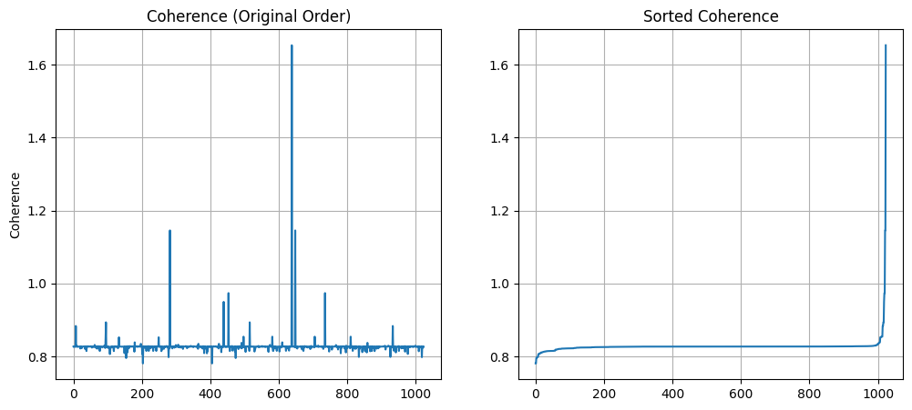

<h1 align="center">🔍 Однопиксельная визуализация со сжатыми измерениями</h1>
<h3 align="center">Сравнение подходов к обучению нейронных сетей без полной реконструкции изображений</h3>

  
  
  
  

> 📌 **Цель проекта**: Исследовать эффективность прямой классификации изображений в пространстве сжатых измерений (без реконструкции) с использованием нейронных сетей для задач однопиксельной визуализации.

---

## 📖 Описание

В условиях, где матричные детекторы недоступны (например, в **терагерцевом диапазоне**, при **низкой освещённости** или **высокой радиационной нагрузке**), однопиксельная визуализация со **сжатыми измерениями** (Compressed Sensing, CS) становится ключевой технологией.

Вместо восстановления полного изображения из ограниченного числа измерений `M << N`, мы обучаем нейронные сети **напрямую классифицировать объекты** по вектору измерений `y = A x`. Это:

- ⏱️ **Ускоряет цикл «измерение → решение»**
- 🛡️ **Снижает дозовую нагрузку** в медицинских исследованиях

Этот репозиторий содержит код, воспроизводящий эксперименты из тезиса, включая:
- генерацию измерений с использованием **матриц Адамара**
- обучение MLP на **исходных**, **зашумлённых** и **восстановленных CS-изображениях**
- сравнение точности при разных уровнях сжатия (`M = 200, 300, 600`)
- анализ устойчивости к аномалиям (на данных EMNIST)

---

## 🧪 Некоторые результаты
Подробные результаты см. в тезисе или в статье (на сентябрь 2025 еще не вышла). Ниже в картинках приведены некоторые результаты. Способ сортировки масок по когерентности, повышающий эффективность алгоритма. Корреляция и SSIM в зависимости от количества измерений и графики изменения точности моделей.

## 🛠️ Технологический стек

- **Язык**: Python 3.8+
- **Фреймворк**: PyTorch + CUDA
- **Датасеты**: MNIST, EMNIST
- **Измерения**: Матрицы Адамара (упорядоченные по убыванию некогерентности `μ`)
- **Модель**: Трёхслойный MLP (полносвязная сеть), трехслойная сверточная сеть
- **Оптимизатор**: Adam
- **Метрика**: Accuracy

---

